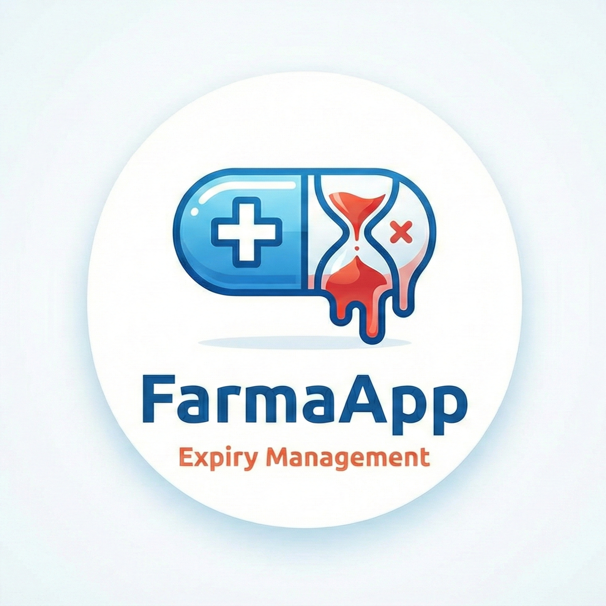
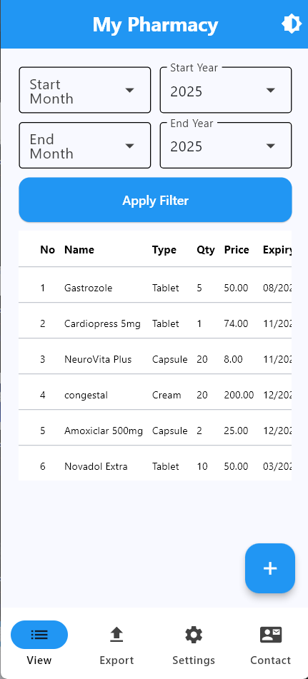
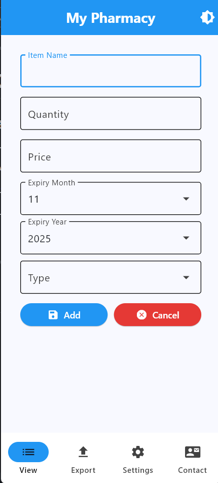
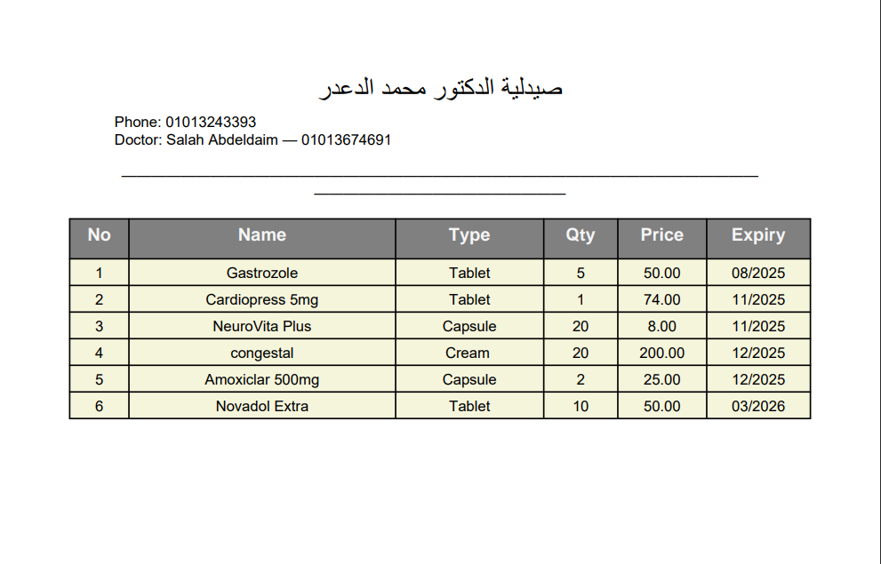
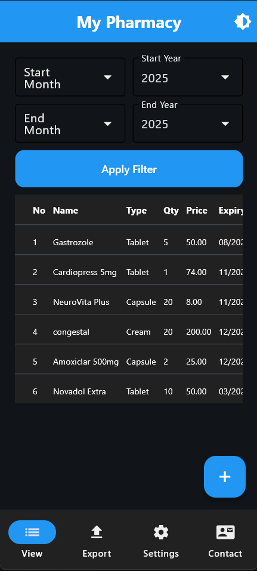

# 💊 FarmaApp - نظام إدارة الصيدليات

<div align="center">
  
  <br><br>
  <b>نظام متكامل لإدارة مخزون الصيدليات، تتبع تواريخ الصلاحية، وإنشاء تقارير PDF تدعم اللغة العربية بالكامل.</b>
  <br><br>

  
  
  
</div>

---

## 📖 نظرة عامة (Overview)

**FarmaApp** هو تطبيق ديسكتوب حديث تم بناؤه باستخدام إطار عمل **Flet** (Python).  
يهدف التطبيق لتبسيط العمليات اليومية في الصيدليات الصغيرة والمتوسطة من خلال إدارة المخزون، تتبع التواريخ، وإعداد تقارير PDF باحترافية.

أهم ما يميز هذا المشروع هو **الدعم الكامل للغة العربية** في الواجهة وفي **تقارير الـ PDF** دون أي مشاكل تقطيع أو اتجاه النص (RTL).

---

## ✨ المميزات الرئيسية (Key Features)

- **إدارة المخزون:** إضافة، تعديل، وحذف الأصناف مع تسجيل الكميات والأسعار.  
- **تتبع تواريخ الصلاحية:** فلترة ذكية حسب الشهر والسنة لتجنب انتهاء الأدوية.  
- **تقارير PDF عربية:** تصدير تقارير جرد احترافية تدعم العربية بالكامل.  
- **قاعدة بيانات SQLite محلية:** حفظ البيانات على جهاز المستخدم مع دعم Auto-Migration.  
- **الوضع الليلي (Dark Mode):** واجهة جذابة ومريحة للعين.  
- **إعدادات مخصصة:** تخصيص اسم الصيدلية وبيانات الطبيب في ترويسة التقارير.

---

## 📸 لقطات شاشة (Screenshots)

| الصفحة الرئيسية | إضافة دواء جديد |
|:---:|:---:|
|  |  |

| تقرير PDF (يدعم العربية) | الوضع الليلي |
|:---:|:---:|
|  |  |

> *(يرجى إضافة الصور الخاصة بك داخل مجلد `assets/` لتظهر هنا)*

---

## 🚀 تشغيل التطبيق (Getting Started)

### 1️⃣ تثبيت المكتبات المطلوبة
تأكد من وجود Python 3.x ثم نفّذ:

```bash
pip install flet reportlab arabic-reshaper python-bidi
```

### 2️⃣ تشغيل التطبيق
```bash
python main.py
```

---

## 🛠️ التقنيات المستخدمة (Tech Stack)

- **Language:** Python 3.x  
- **GUI Framework:** Flet (Flutter-based)  
- **Database:** SQLite3  
- **PDF Engine:** ReportLab  
- **Arabic Text Handling:** arabic-reshaper, python-bidi  

---

<div align="center">
  Developed with ❤️ by <b>Salah Abdeldaim</b>
</div>

---
